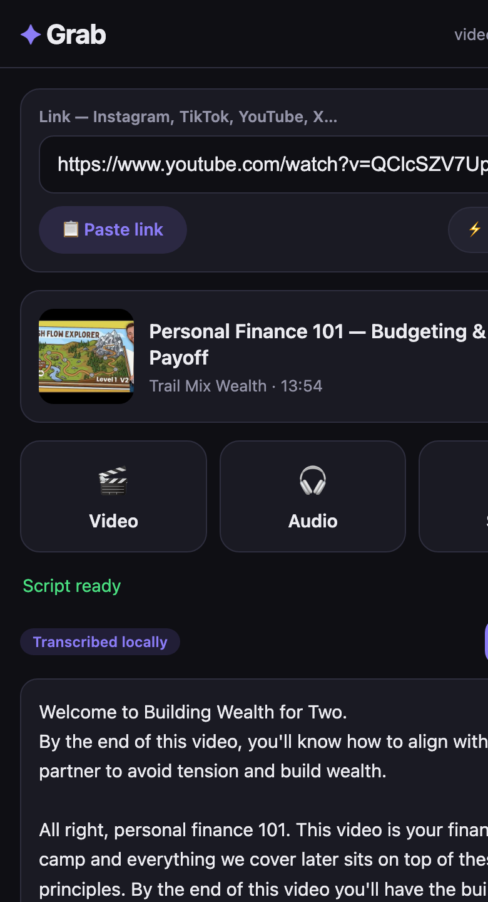
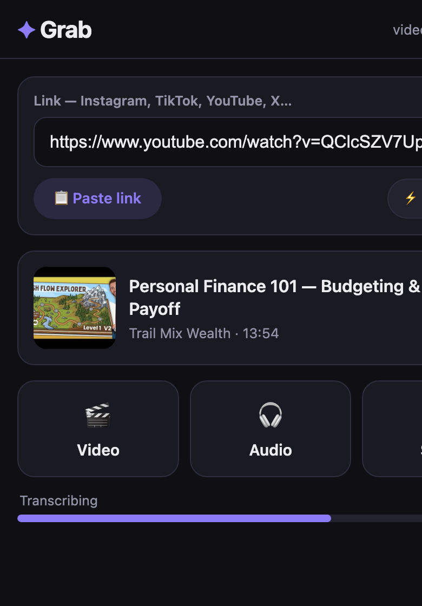
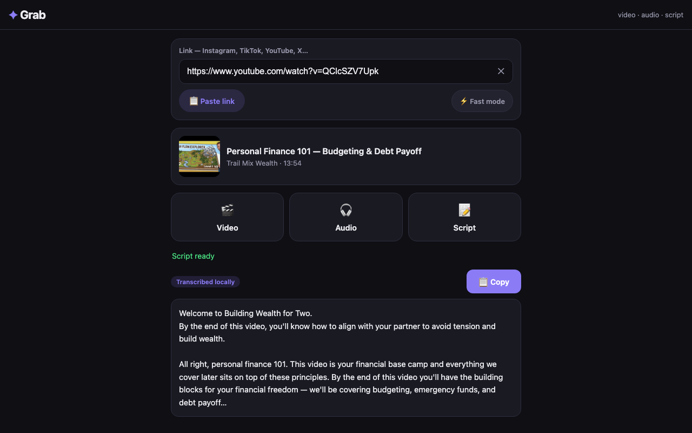

# ✦ Grab

**Paste a social media link → get the video, the audio, or the script.**

A tiny self-hosted web app for saving content from Instagram, TikTok, YouTube,
X, Facebook and [~1,800 other sites](https://github.com/yt-dlp/yt-dlp/blob/master/supportedsites.md).
Runs entirely on your own machine — no ads, no accounts, no data leaves your Mac.

|  Phone — script ready | Phone — transcribing | Desktop |
|:--:|:--:|:--:|
|  |  |  |

## What it does

- 🎬 **Video** — downloads the post as an `.mp4`, saved through your browser's
  native download manager with a proper filename.
- 🎧 **Audio** — extracts just the sound as a 192 kbps `.mp3`.
- 📝 **Script** — gets you the spoken words as text you can copy with one tap:
  - If the platform has **captions**, they're fetched instantly
    (English, German, Arabic and French are checked, in that order).
  - If not, the audio is **transcribed locally** with Whisper. On Apple
    Silicon this runs on the GPU — a 15-minute video takes ~15 seconds,
    and the language (en/de/ar/fr and ~90 more) is detected automatically.

Everything runs as a background job with a live progress bar — your phone can
lock or leave the page, and the job keeps going. Re-open, tap again, and it
re-attaches. Finished scripts are cached for an hour.

## Why not a website?

Tools like this die when they're hosted publicly: platforms block datacenter
IPs, and the heavy lifting (downloading, converting, transcribing) needs real
compute. Grab runs on **your** computer and is served to **your** phone over
your home Wi-Fi — fast, private, and free.

## Setup (macOS)

```sh
git clone https://github.com/jihenBouguerra/grab.git
cd grab
./setup.sh        # venv + deps, ffmpeg, Whisper model, native whisper.cpp build
```

## Run

Double-click **`start.command`** in Finder (it also auto-updates yt-dlp), or:

```sh
.venv/bin/python app.py
```

Then open:

- **On the Mac:** http://localhost:5001
- **On your phone:** `http://<your-mac-ip>:5001` — printed when the server
  starts. Must be on the same Wi-Fi. Tip: use Safari's *Add to Home Screen*
  to make it feel like a real app.

## How it works

```
Browser (static/index.html)
   │  POST /api/job {url, kind}          ← starts a background job
   │  POST /api/job {url, kind, poll}    ← polls progress (1.5s)
   ▼
Flask (app.py)
   ├─ video/audio → yt-dlp (+ffmpeg)  → one-time download token → /api/take/<t>
   └─ script      → platform captions → fallback: yt-dlp audio → whisper.cpp
                                                     (native arm64 + Metal GPU)
```

Implementation notes:

- **One transcription at a time** — concurrent script requests get a polite
  "wait for it to finish" instead of stacking CPU/GPU work.
- Caption requests use **exact language codes** (`en`, `de`, `ar`, `fr`, …) —
  wildcards match auto-translated junk like `en-de` and get you rate-limited.
- Videos longer than 20 min without captions are refused
  (`MAX_TRANSCRIBE_SECONDS` in `app.py`).
- For better Arabic/German accuracy, drop `ggml-small.bin` from
  [whisper.cpp models](https://huggingface.co/ggerganov/whisper.cpp) into
  `models/` and point `WHISPER_MODEL` at it — still fast on the GPU.

## Troubleshooting

| Problem | Fix |
|---|---|
| A platform suddenly stops working | `.venv/bin/pip install -U yt-dlp` (start.command does this automatically) |
| "Post seems private" | Login-only/private posts can't be fetched anonymously |
| Transcription is slow | Make sure `bin/whisper-cli` exists and is a native build (`./setup.sh` rebuilds it) |
| Phone can't reach the app | Same Wi-Fi? Mac firewall allowing Python? |

## Legal

For personal use with content you have the right to download. Respect the
platforms' terms of service and creators' rights.
